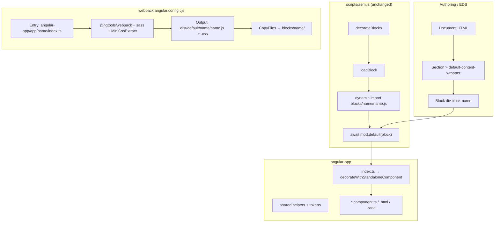
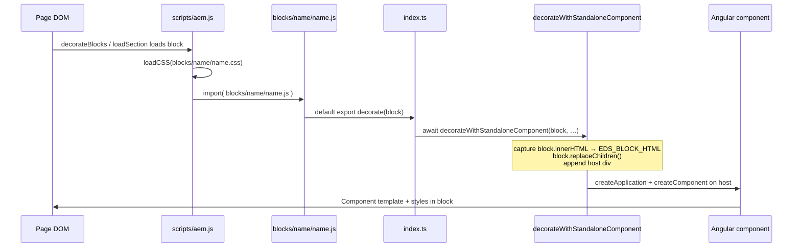

# EDS Angular POC

This repository extends the [Adobe AEM boilerplate](https://github.com/adobe/aem-boilerplate) for **Edge Delivery Services (EDS)** with **Angular** block bundles. Authoring and page structure follow normal EDS rules; Angular code lives under `angular-app/` and is compiled into standard EDS block assets (`blocks/<name>/<name>.js` and `.css`).

- **EDS runtime** is unchanged: `scripts/aem.js` is the stock file (do not edit). Blocks load the same way as vanilla JS blocks.
- **No `block-config.js`** in block folders: the integration uses the standard pattern **`export default async function decorate(block)`** only.
- **`eds-web/`** is reference-only (React/commerce sample); production code targets `blocks/`, `scripts/`, `styles/`.

---

## Documentation

1. [Developer Tutorial](https://www.aem.live/developer/tutorial)
2. [The Anatomy of a Project](https://www.aem.live/developer/anatomy-of-a-project)
3. [Web Performance](https://www.aem.live/developer/keeping-it-100)
4. [Markup, Sections, Blocks, and Auto Blocking](https://www.aem.live/developer/markup-sections-blocks)

---

## Installation

```sh
npm install
```

---

## NPM scripts

| Script | Purpose |
|--------|---------|
| `npm run angular:build` | Production webpack build → copies artifacts into `blocks/` (and `dist/default/`) |
| `npm run angular:watch` | Development webpack in watch mode (faster, no minify by default); updates `blocks/` on each successful build |
| `npm run dev:angular` | Runs **AEM CLI** (`aem up --no-open`) and **`angular:watch`** together via `concurrently` |
| `npm run lint` | ESLint + Stylelint |
| `npm run lint:fix` | Auto-fix |

Local site: **`http://localhost:3000`** (AEM CLI). Run `npm run dev:angular` or two terminals: `npx @adobe/aem-cli up --no-open` and `npm run angular:watch`.

---

## High-level architecture



---

## End-to-end flow (Angular block)



### Steps in plain language

1. **Markup**: The block appears as `<div class="name">…authored content…</div>` (and `data-block-name` is set by `decorateBlock` in `aem.js`).
2. **CSS**: `loadBlock` loads `blocks/<name>/<name>.css` (emitted by webpack from your component SCSS imports).
3. **JS**: `loadBlock` dynamically imports `blocks/<name>/<name>.js` (ESM). It must **`export default` a `decorate` function**.
4. **`decorate(block)`** (from `index.ts`) calls **`decorateWithStandaloneComponent`**, which:
   - Optionally stores **`block.innerHTML`** in the **`EDS_BLOCK_HTML`** injection token (for reading authored markup in components).
   - Clears the block and mounts a **host** `<div>`.
   - Bootstraps a **standalone Angular component** on that host with Zone.js.
5. The **component** renders UI; authored HTML can be parsed (e.g. first `<p>` as title) or shown via `[innerHTML]` with `DomSanitizer`.

---

## Repository layout (Angular-related)

```
angular-app/
├── app/
│   ├── <block-name>/
│   │   ├── index.ts                 # Webpack entry; default export decorate(block)
│   │   ├── <block-name>.component.ts
│   │   ├── <block-name>.component.html
│   │   └── <block-name>.component.scss
│   └── …                            # e.g. angular-demo, header
├── shared/
│   ├── decorate-with-standalone-component.ts
│   └── block-tokens.ts
├── eds-imports.d.ts                 # TypeScript declarations for @eds/* imports
├── tsconfig.json
└── tsconfig.app.json

webpack.angular.config.cjs           # Angular webpack build + copy to blocks/

blocks/
├── <block-name>/
│   ├── <block-name>.js              # Built ESM bundle (do not hand-edit)
│   └── <block-name>.css             # Extracted styles
└── fragment/fragment.js               # Used by header (loadFragment); unchanged pattern
```

---

## File and API reference

### `angular-app/app/<block>/index.ts`

| Symbol | Role |
|--------|------|
| **`decorate(block)`** (default export) | **EDS contract**: must be the default export. `aem.js` calls `await mod.default(block)`. Imports Zone.js, pulls in block CSS for MiniCssExtract, then calls `decorateWithStandaloneComponent`. |

Side-effect imports:

- `import 'zone.js'` — required for Angular change detection in the browser bundle.
- `import './<block>.component.scss'` — so webpack emits `blocks/<block>/<block>.css` for `loadCSS`.

---

### `angular-app/shared/decorate-with-standalone-component.ts`

| Symbol | Role |
|--------|------|
| **`StandaloneBlockMountOptions<C>`** | Options: `component` (standalone component class), `hostClassName`, optional `passAuthoredHtml` (default `true`), optional `providers` factory. |
| **`decorateWithStandaloneComponent(block, blockConfig, options)`** | Runs previous teardown if the same block is re-decorated. Captures `block.innerHTML` when `passAuthoredHtml !== false`, registers **`EDS_BLOCK_HTML`**, clears **`block`**, appends a host **`div`**, **`createApplication`** + **`createComponent`** with **`hostElement`**, attaches view, stores teardown (destroy app + component) in a **`WeakMap`** keyed by **`block`**. |

---

### `angular-app/shared/block-tokens.ts`

| Symbol | Role |
|--------|------|
| **`EDS_BLOCK_HTML`** | **`InjectionToken<string>`** — authored HTML string captured **before** `replaceChildren()`. Inject in components with `inject(EDS_BLOCK_HTML, { optional: true })`. |

---

### `angular-app/eds-imports.d.ts`

| Symbol | Role |
|--------|------|
| **Module `@eds/scripts/aem`** | Declares typings for **`getMetadata`** (and any other symbols you re-export from the real `scripts/aem.js` via webpack alias). |
| **Module `@eds/blocks/fragment`** | Declares **`loadFragment`** for the fragment block script. |

Webpack **`resolve.alias`** maps these to the real files under `scripts/` and `blocks/fragment/`.

---

### `angular-app/app/<block>/<block>.component.ts` (example patterns)

#### `angular-demo` (`angular-demo.component.ts`)

| Member | Role |
|--------|------|
| **`authoredHtml`** | `inject(EDS_BLOCK_HTML, { optional: true })` — string captured in `decorateWithStandaloneComponent` before the block is cleared. |
| **`authoredHeading`** | `computed` — parses `authoredHtml` with **`DOMParser`**, reads the first **`p`** text for the `<h2>`, or **`DEFAULT_HEADING`** if missing. |
| **`safeAuthoredBody`** | `computed` — removes the first **`p`** from a parsed copy, then **`bypassSecurityTrustHtml`** for **`[innerHTML]`** on the rest (avoids duplicating the heading). |

#### `header` (`header.component.ts`)

Private helpers (vanilla DOM, same behavior as classic `blocks/header/header.js`):

| Function | Role |
|----------|------|
| **`closeOnEscape`**, **`closeOnFocusLost`**, **`openOnKeydown`**, **`focusNavSection`** | Keyboard / focus behavior for nav and dropdowns. |
| **`toggleAllNavSections`**, **`toggleMenu`** | Open/close sections and mobile menu; syncs **`aria-expanded`** and body scroll. |
| **`detachHeaderNav(host)`** (exported) | Clears **`resizeHandler`** on **`matchMedia`**, **`host.replaceChildren()`**. |
| **`initHeaderNav(host)`** (exported) | Loads fragment from **`getMetadata('nav')`** path or **`/nav`**, builds **`<nav id="nav">`**, hamburger, section classes, click handlers, appends **`.nav-wrapper`**. |

Component:

| Member | Role |
|--------|------|
| **`HeaderComponent`** | Standalone; **`ViewEncapsulation.None`** so `header nav` SCSS applies to injected DOM. |
| **`ngOnInit`** | **`initHeaderNav(this.el.nativeElement)`** (async fire-and-forget). |
| **`ngOnDestroy`** | **`detachHeaderNav(this.el.nativeElement)`**. |

**`header/index.ts`** passes **`passAuthoredHtml: false`** so **`EDS_BLOCK_HTML`** is not populated (header content comes from the nav fragment, not the block’s initial HTML).

---

### `webpack.angular.config.cjs` (behavioral summary)

| Area | Behavior |
|------|----------|
| **Entry** | One entry per folder under `angular-app/app/`: `./angular-app/app/<name>/index.ts` (no multi-entry with raw SCSS — that broke ESM `export` in the past). |
| **Output** | **`library.type: 'module'`** so **`import()`** from `aem.js` receives **`mod.default`**. |
| **CSS** | **`MiniCssExtractPlugin`** for non–`?ngResource` imports; Angular **`styleUrl`** uses **`?ngResource`** and **`css-loader`** string mode. |
| **`CopyFiles` plugin** | On successful compile, copies **`dist/default/**/*`** → **`blocks/`**, excluding vendor/chunks/maps/licenses/HMR junk. Does **not** copy optional `scripts/chunks` / `scripts/vendor` folders (splitChunks is off). |
| **Externals** | **`@eds/scripts/aem`**, **`@eds/blocks/fragment`** resolve to runtime paths under **`scripts/`** and **`blocks/fragment/`** so bundles do not duplicate AEM core. |
| **Babel** | **`@angular/compiler-cli` linker** on **`node_modules/@angular/**`** for partial Ivy packages. |

---

### `scripts/aem.js` (reference — do not edit)

| Function | Role |
|----------|------|
| **`loadBlock(block)`** | Sets status, loads **`blocks/${blockName}/${blockName}.css`**, **`import()`** of **`blocks/${blockName}/${blockName}.js`**, **`await mod.default(block)`** if present. |
| **`decorateBlock(block)`** (internal) | Sets **`dataset.blockName`**, adds **`block`** class, **`wrapTextNodes`**, etc. |

---

## Built output per block

After **`npm run angular:build`**, each block folder should contain:

- **`blocks/<name>/<name>.js`** — ESM with **`export default function decorate`**
- **`blocks/<name>/<name>.css`** — styles for `loadCSS`

Do not add **`block-config.js`** for this POC; decoration is fully driven by the default export.

---

## Adding a new Angular block

1. Create **`angular-app/app/<block-name>/`** with **`index.ts`**, **`<block-name>.component.ts`**, **`.html`**, **`.scss`** (same basename pattern as existing blocks).
2. Run **`npm run angular:build`** (or **`angular:watch`**).
3. Confirm **`blocks/<block-name>/`** contains **`.js`** and **`.css`**.
4. Author content in the document with a block whose first class is **`<block-name>`** (same name as the folder).

---

## Environments

- Preview: `https://main--{repo}--{owner}.aem.page/`
- Live: `https://main--{repo}--{owner}.aem.live/`

---

## Linting

```sh
npm run lint
npm run lint:fix
```

---

## License

Apache License 2.0 (see boilerplate).
